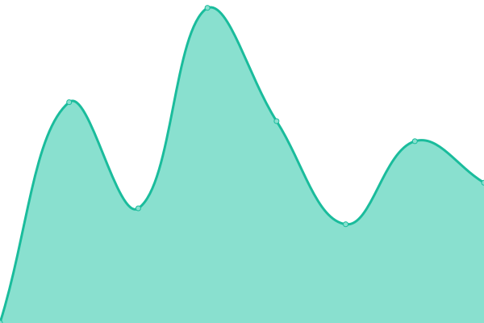

# [📈 Live Status](https://status.aev.com.ua): <!--live status--> **🟧 Partial outage**

This repository contains the open-source uptime monitor and status page for [aevua](https://status.aev.com.ua), powered by [Upptime](https://github.com/upptime/upptime).

With [Upptime](https://upptime.js.org), you can get your own unlimited and free uptime monitor and status page, powered entirely by a GitHub repository. We use [Issues](https://github.com/aevua/upptime/issues) as incident reports, [Actions](https://github.com/aevua/upptime/actions) as uptime monitors, and [Pages](https://status.aev.com.ua) for the status page.

<!--start: status pages-->
<!-- This summary is generated by Upptime (https://github.com/upptime/upptime) -->
<!-- Do not edit this manually, your changes will be overwritten -->
<!-- prettier-ignore -->
| URL | Status | History | Response Time | Uptime |
| --- | ------ | ------- | ------------- | ------ |
|  [aevua](https://aev.com.ua) | 🟥 Down | [aevua.yml](https://github.com/aevua/upptime/commits/HEAD/history/aevua.yml) | 

 697ms
     
 | 

<a href="https://status.aev.com.ua/history/aevua">43.92%</a>
    

|  [aevua-dev](https://aevua.artas90.top) | 🟩 Up | [aevua-dev.yml](https://github.com/aevua/upptime/commits/HEAD/history/aevua-dev.yml) | 

 701ms
     
 | 

<a href="https://status.aev.com.ua/history/aevua-dev">100.00%</a>
    

|  [neurocracy](https://neurocracy.net) | 🟩 Up | [neurocracy.yml](https://github.com/aevua/upptime/commits/HEAD/history/neurocracy.yml) | 

 815ms
     
 | 

<a href="https://status.aev.com.ua/history/neurocracy">100.00%</a>
    

<!--end: status pages-->

[**Visit our status website →**](https://status.aev.com.ua)

## 📄 License

- Powered by: [Upptime](https://github.com/upptime/upptime)
- Code: [MIT](./LICENSE) © [Anand Chowdhary](https://anandchowdhary.com), supported by [Pabio](https://pabio.com)
- Data in the `./history` directory: [Open Database License](https://opendatacommons.org/licenses/odbl/1-0/)
